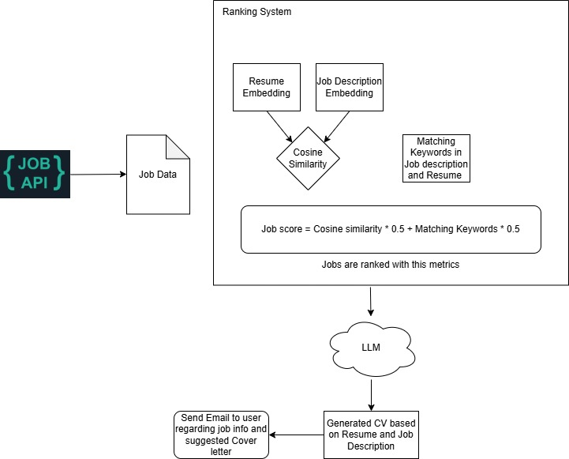

# Job Recommendation System

## Overview
This project is a **Job Recommendation System** that fetches job postings via an API, ranks them based on relevance to a user's resume, and generates a suggested cover letter. The system uses **Cosine Similarity** and **Keyword Matching** to rank job listings and employs a **Large Language Model (LLM)** to enhance the process by creating personalized CVs and cover letters.

This project was inspired by and references **[Jobs_Applier_AI_Agent_AIHawk](https://github.com/feder-cr/Jobs_Applier_AI_Agent_AIHawk)**.

### System Flow
1. **Fetch Job Data**: Jobs are retrieved from an API.
2. **Ranking System**:
   - The system converts both the **resume** and **job descriptions** into embeddings.
   - Uses **Cosine Similarity** to measure the match between resume and job description.
   - Extracts **matching keywords** from both the job description and the resume.
   - Computes a **job score** based on:
     ```
     Job Score = (Cosine Similarity * 0.5) + (Matching Keywords * 0.5)
     ```
   - Jobs are ranked using this metric.
3. **LLM Processing**:
   - Generates a **CV** customized for the best-matching jobs.
   - Prepares a **suggested cover letter** tailored to each job listing.
4. **Email Notification**:
   - Sends an email to the user with **job details** and the **generated cover letter** as an attachment.

### Diagram


## Installation & Setup

### Prerequisites
Ensure you have the following installed:
- Python 3.10+
- `pip` (Python package manager)

### Steps to Run
1. Clone the repository:
   ```sh
   git clone https://github.com/mattChrisP/job_info
   cd job_info
   ```

2. Install required dependencies:
   ```sh
   pip install -r requirements.txt
   ```

3. Create a `.env` file in the root directory and add the following variables:
   ```env
   GOOGLE_API_KEY=<your_gemini_api_key>
   GMAIL_ADDRESS=<your_gmail_address>
   GMAIL_APP_PASSWORD=<your_gmail_app_password>
   JOB_API=<your_job_api_key>
   ```
   - **GMAIL_ADDRESS** and **GMAIL_APP_PASSWORD**: Set up Gmail SMTP settings.
   - **GOOGLE_API_KEY**: Obtain an API key from **Google Gemini API**.
   - **JOB_API**: API key from [API Jobs](https://www.apijobs.dev/).

4. Place your resume file in the root directory and ensure it is named **Resume.pdf**.

5. Run the project:
   ```sh
   python info.py
   ```

## Features
- **Job Ranking Algorithm**: Uses **cosine similarity** and **keyword matching** to rank jobs.
- **LLM-Generated Documents**: Generates **CVs** and **cover letters** tailored to each job.
- **Automated Email Notifications**: Sends **job opportunities and cover letters** via email.

## Demo
Demo can be seen in my **[Portfolio](https://my-portfolio-six-ochre.vercel.app/)**.

---
Feel free to contribute or raise an issue if you have suggestions for improvements!

